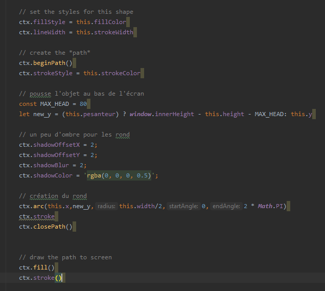
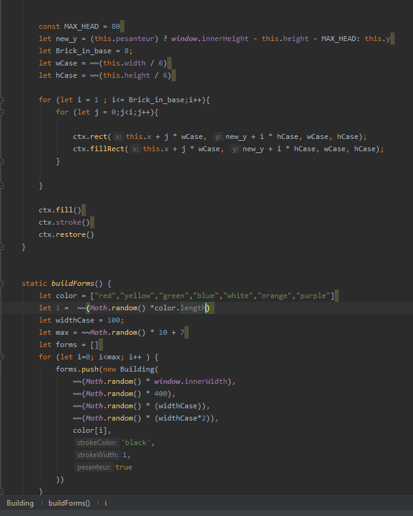
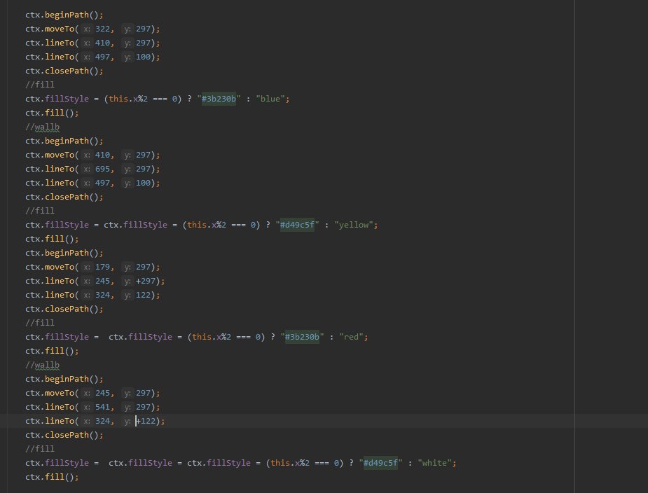

## Générateur de paysages virtuels 
## KANOUTE HAMIDOU SIO12


Projet de développement logiciel à destinatation d'apprentis développeur.

Objectifs  

* prise en main d'une petite application javascript (sans framework)
* programmation en javascript dans une approche objet et événementielle
* utilisation de l'API 2D JS intégrée
* développement de la créativité  

### Squelette de l'application

#### structure des dossiers

```
.
├── css
│   ├── lavalamp.png
│   ├── layout.css
│   ├── menu_bg.png
│   ├── menu.css
│   └── menu_line.png
├── docs
│   ├── analyse.dia
│   ├── analyse.png
│   ├── java-genPaysageEtudiant.zip
│   └── java-paysage-virutel.png
|
├── js
│   ├── main.js
│   └── modules
│       ├── AbstractForm.js
│       ├── Cloud.js
|       ├── Immeuble.js
|       ├── Planete.js
|       ├── Building.js
|       ├── Rond.js
|       ├── Stickman.js
|       ├── Triangle.js
│       └── TruePyramide.js
|      
├── index.html
└── README.md
```
# Les classe ajoutés ou à venir
|Classe Prévue|Classe ajouté|classe prévue|
|:---------: |:-----:|:-------:|
|Cloud.js    | ✔     |   ✗    |
|Building.js | ✔     |   ✗    |
|Stickman.js | ✔     |   ✗    |
|Rond.js     | ✔     |   ✗    |


## Première classe ajoutés
* ## Rond.js


Afin de comprendre la structure et prendre en main le code déjà présent, j'ai crée la classe rond.js en me bassant sur les classe immeuble et triangle, une fois la création du rond reussi,
j'ai fait beaucoup de teste sur cette dernière afin d'améliorer ma maîtrise du javascript ainsi que comprendre en détail chaque fonction. 

* ### Building.js


Cette seconde classe à pour but la réalisation de building, ce fut sans difficulté une boucle suffit pour sa création.Et afin de rendre cela plus
plus coloré j'ai initialisé un tableau de couleur "color" dans le quel on va choisir une couleur aléatoir pour chaque building grâce à la variable i qui est une variable aléatoir entre 0 la taille du tableau
* ###TruePyramide et Stickman
Cette troisième classe est le fruit de recherche sur internet et à permis de crée une vrai pyramide d'ou le nom "TruePyramide" de même pour stickman.

# Problème rencontrer 


#### Voici le code perméttant de dessiner les pyramides,et nous pouvons voir que les coordonées sont fixent ce qui donne des dessins fixe comme ci-dessous.


#### Cependant l'ojectif de ce projet est de crée des paysage de façon aléatoire de ce fait il fait mettre des coordonnés de façon aléatoire.


#Solution


