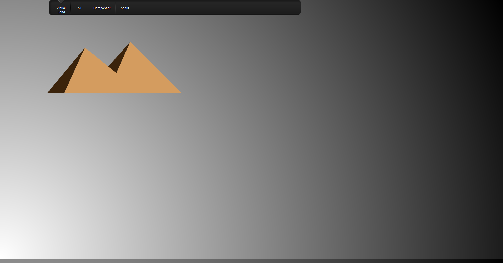
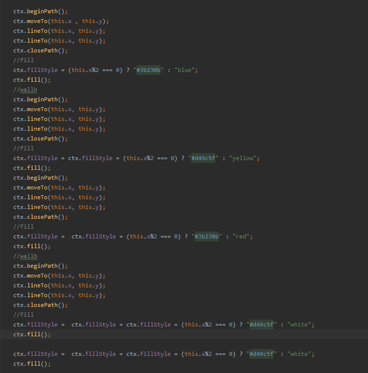
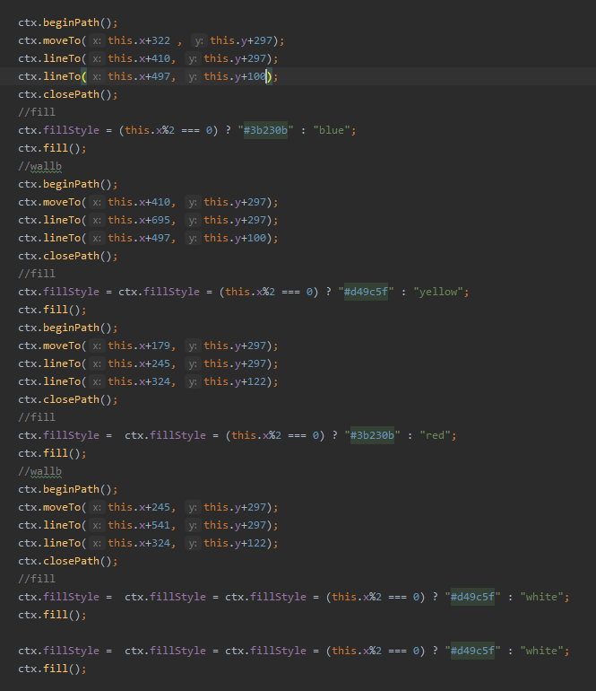
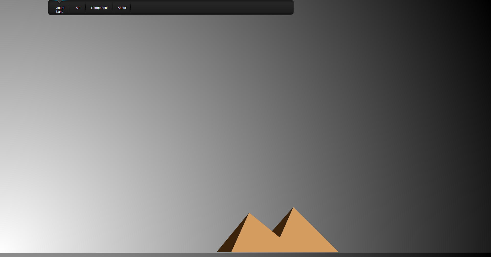
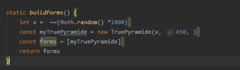
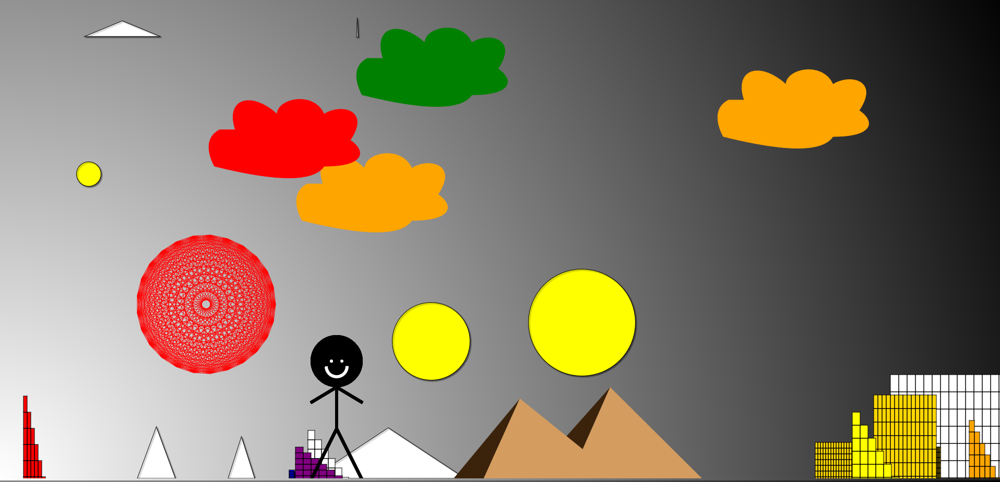
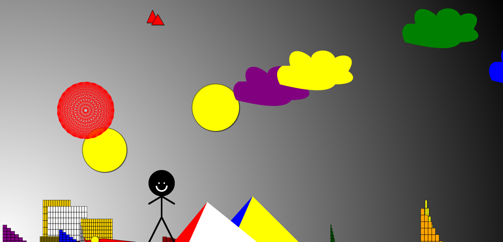
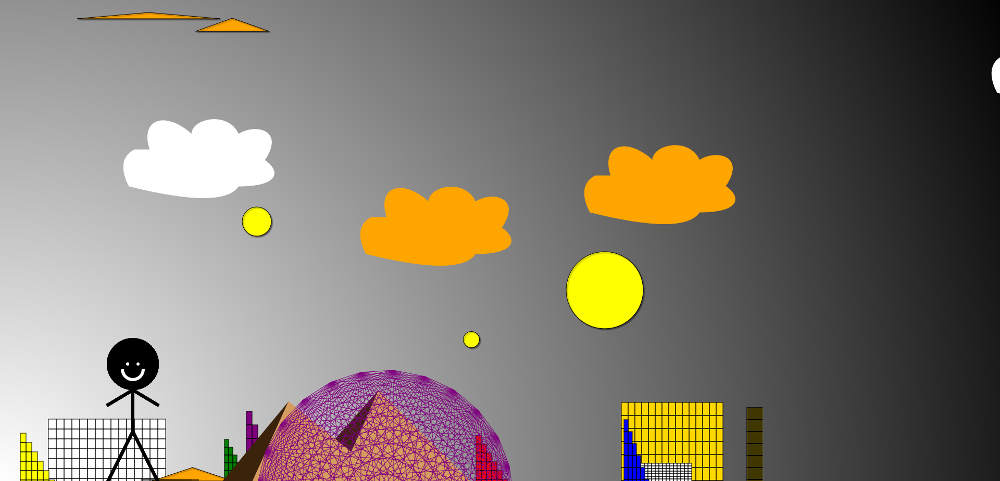

## Générateur de paysages virtuels 
## KANOUTE HAMIDOU SIO12


Projet de développement logiciel à destinatation d'apprentis développeur.

Objectifs  

* prise en main d'une petite application javascript (sans framework)
* programmation en javascript dans une approche objet et événementielle
* utilisation de l'API 2D JS intégrée
* développement de la créativité  

### Squelette de l'application

#### structure des dossiers

```
.
├── css
│   ├── lavalamp.png
│   ├── layout.css
│   ├── menu_bg.png
│   ├── menu.css
│   └── menu_line.png
├── docs
│   ├── analyse.dia
│   ├── analyse.png
│   ├── java-genPaysageEtudiant.zip
│   └── java-paysage-virutel.png
|
├── js
│   ├── main.js
│   └── modules
│       ├── AbstractForm.js
│       ├── Cloud.js
|       ├── Immeuble.js
|       ├── Planete.js
|       ├── Building.js
|       ├── Rond.js
|       ├── Stickman.js
|       ├── Triangle.js
│       └── TruePyramide.js
|      
├── index.html
└── README.md
```
# Les classe ajoutés ou à venir
|Classe Prévue|Classe ajouté|classe prévue|
|:---------: |:-----:|:------:|
|Cloud.js    | ✔     |      |
|Building.js | ✔     |      |
|Stickman.js | ✔     |      |
|Rond.js     | ✔     |      |
|Tree.js     |       | ✔    |


## Première classe ajoutés
* ## Rond.js


Afin de comprendre la structure et prendre en main le code déjà présent, j'ai créé la classe rond.js en me basant sur les classes immeuble et triangle, une fois la création du rond réussi,
J'ai fait beaucoup de tests sur cette dernière afin d'améliorer ma maîtrise du JavaScript ainsi que comprendre en détail chaque fonction.

* ### Building.js


Cette seconde classe a pour but la réalisation de building, ce fut sans difficulté une boucle suffi pour sa création. Et afin de rendre cela plus
Plus coloré, j'ai initialisé un tableau de couleur "color" dans lequel on va choisir une couleur aléatoire pour chaque building grâce à la variable i qui est une variable aléatoire entre 0 la taille du tableau.
* ### TruePyramide, cloud et Stickman
Ces classes sont le fruit de recherche, de réflexion étant donné qu'ils sont basés sur des tutoriels en ligne, il a fallu les adapter à la structure de mon projet.


# Problème rencontrés 


#### Voici le code permettant de dessiner les pyramides, et nous pouvons voir que les coordonnées sont fixent ce qui donne des dessins fixe comme ci-dessous.



#### Cependant, l'objectif de ce projet est de créer des paysages de façon aléatoire de ce fait, il faut mettre des coordonnées de façon aléatoire.



#### Sauf que cela a pour conséquence de défigurer les pyramides...

# Solution

#### La solution trouvée à été trouver par chance, après plusieurs jours à cherché comment résoudre ce problème, je me suis simple dit " si j'ajoute des valeurs aléatoire au valeur déjà présente cela donnerai quoi ?", cela a permit de résoudre les problèmes de coordonner et de pyramide défigurée.

 


#Mais la structure reste toujours fixe. Mais cela fut simple de la rendre mobile grâce à la fonction Buildforms j'ai simplement eu besoin d'avoir une position x aléatoire comme ci-dessous.




## Cette solution s'applique aussi au autre classe ajoutés comme cloud.js ou stickman.js

# Voici quelques exemples de paysage que ce programme peut afficher








